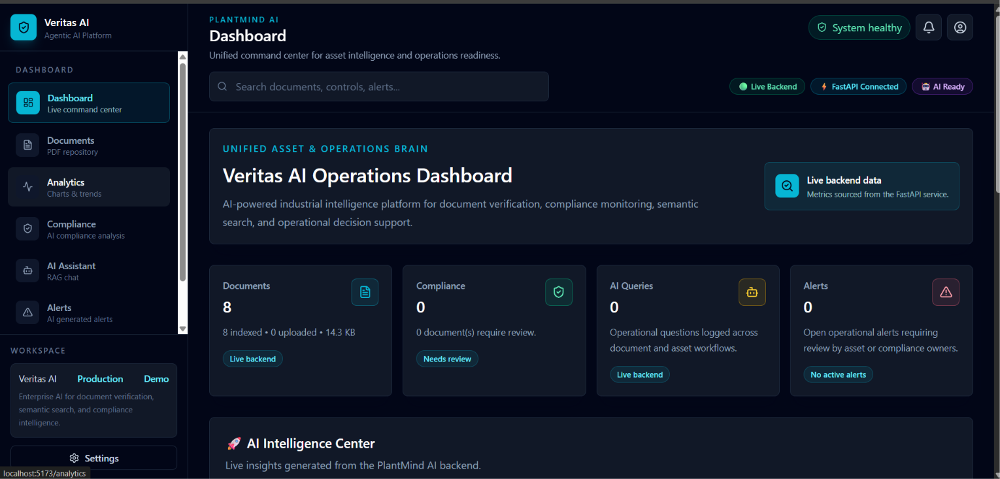
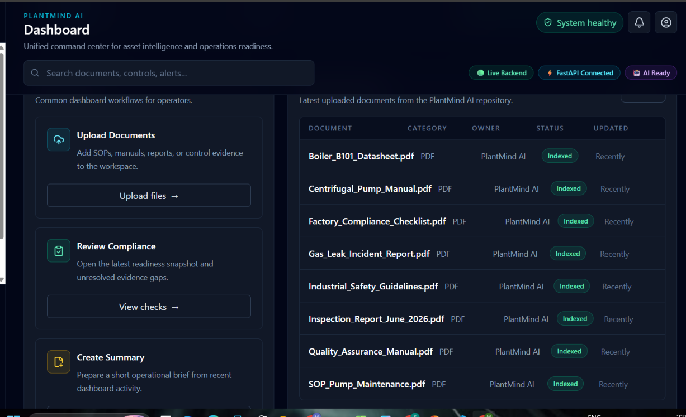
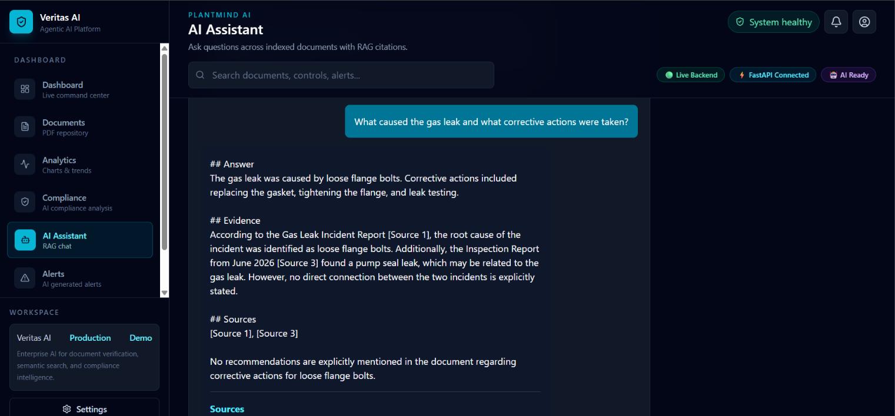
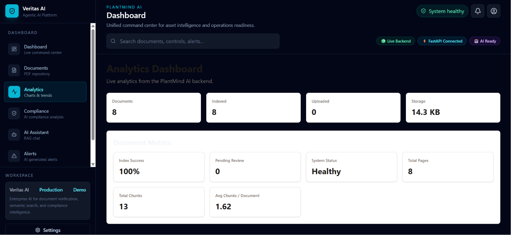

# 🚀 Veritas AI
### Transform Industrial Knowledge Into Intelligent Operations

Veritas AI is an **enterprise AI platform** that transforms fragmented industrial documentation into a searchable, conversational operations brain using **Retrieval-Augmented Generation (RAG)**, **semantic search**, and **local LLM inference**.

Built for **ET AI Hackathon 2.0 – Grand Finale (Problem Statement 8: Unified Asset & Operations Brain)**.

---

## 📌 Problem Statement

Industrial organizations manage thousands of:

- Standard Operating Procedures (SOPs)
- Maintenance Manuals
- Inspection Reports
- Safety Guidelines
- Compliance Documents
- Engineering Reports
- Technical PDFs

This knowledge is scattered across disconnected documents, making information retrieval slow, inefficient, and difficult to audit.

---

# 💡 Solution

Veritas AI creates a unified enterprise knowledge layer where engineers can ask questions in natural language and receive **grounded, source-backed answers** from their own documents.

Unlike traditional keyword search, Veritas AI understands document meaning using semantic search and Retrieval-Augmented Generation (RAG).

---

# ✨ Key Features

- 📄 PDF Document Upload
- 🔍 Semantic Search
- 🤖 AI Assistant powered by RAG
- 📚 Source Citations for every answer
- 🧠 Local LLM using Ollama + Llama 3
- ⚡ FastAPI Backend
- 📊 Analytics Dashboard
- ✅ Compliance Dashboard
- 📁 Document Management
- 🔒 Privacy-first local deployment

---

# 🏗️ System Architecture

```
                User
                  │
                  ▼
        React + TypeScript Frontend
                  │
                  ▼
            FastAPI Backend
                  │
                  ▼
           PDF Text Extraction
                  │
                  ▼
        Document Chunking
        (400 Tokens, 100 Overlap)
                  │
                  ▼
   Sentence Transformer Embeddings
                  │
                  ▼
             ChromaDB
         (Vector Database)
                  │
                  ▼
        Top-K Semantic Retrieval
                  │
                  ▼
          Prompt Assembly
                  │
                  ▼
      Ollama + Llama 3 (Local)
                  │
                  ▼
     Grounded Response + Citations
```

---

# 🔄 Retrieval Pipeline

```
PDF Upload
      ↓
Text Extraction
      ↓
Chunking
      ↓
Embedding Generation
      ↓
ChromaDB Storage
      ↓
Top-K Retrieval
      ↓
Prompt Assembly
      ↓
Llama 3 (Ollama)
      ↓
Grounded Response
      ↓
Source Citations
```

---

# 🛠️ Tech Stack

## Frontend

- React
- TypeScript
- Vite
- Tailwind CSS

## Backend

- Python
- FastAPI

## AI Stack

- Ollama
- Llama 3
- LangChain
- Sentence Transformers
- ChromaDB

## PDF Processing

- PyPDF

---

# 📂 Project Structure

```
veritas-ai/
│
├── backend/
│   ├── routes/
│   ├── services/
│   ├── uploads/
│   ├── chroma_db/
│   └── main.py
│
├── frontend/
│
└── inspect_ollama.py
```

---

# 📸 Screenshots

Add screenshots here after uploading them.

## 📸 Dashboard



## 📄 Documents



## 🤖 AI Assistant



## 📊 Analytics



---

# 🚀 Getting Started

## Backend

```bash
cd backend

python -m venv venv

source venv/bin/activate
# Windows
venv\Scripts\activate

pip install -r requirements.txt

uvicorn main:app --reload
```

---

## Frontend

```bash
cd frontend

npm install

npm run dev
```

---

# 🎯 Why Retrieval-Augmented Generation (RAG)?

Industrial documentation changes frequently.

Instead of retraining an AI model whenever new manuals or SOPs are added, Veritas AI simply indexes the new documents.

This allows:

- Immediate knowledge updates
- Better scalability
- Grounded responses
- Source-backed citations
- Reduced hallucinations

---

# 🔒 Privacy First

Veritas AI performs local inference using **Ollama + Llama 3**, helping organizations process sensitive industrial documents within their own infrastructure and reducing reliance on external AI services.

---

# 📈 Future Roadmap

- OCR Support
- P&ID Parsing
- Knowledge Graph
- Computer Vision
- Voice Assistant
- Predictive Maintenance
- Digital Twin Integration
- Enterprise Connectors
- Cloud + On-Prem Hybrid Deployment

---

# 👥 Team

### Team Sam

**Shaik Mahammad Mathin**

SRM University AP

**Shaik Sameera Kowsar**

Tirumala Engineering College

---

# 🏆 Hackathon

**ET AI Hackathon 2.0**

Grand Finale

Problem Statement 8

Unified Asset & Operations Brain

---

# 📄 License

This project is released under the MIT License.

---

## ⭐ Veritas AI

**Transforming industrial documents into an intelligent, searchable operations brain.**
